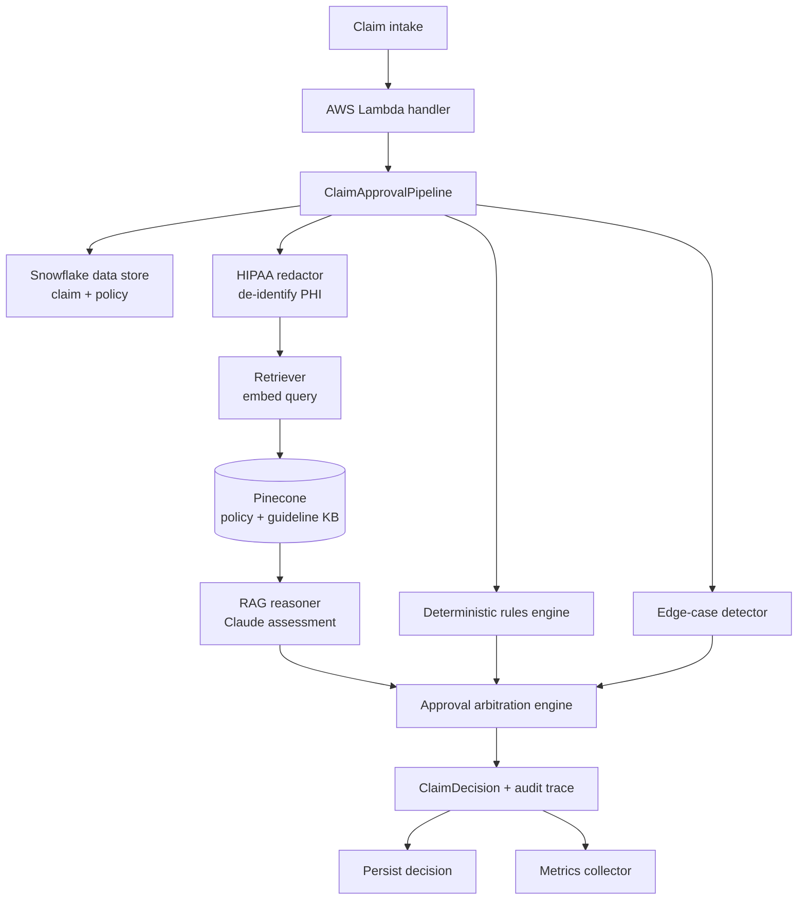

# Automated Insurance Claim Approval Engine

A production-grade, **RAG-based** (Retrieval-Augmented Generation) decision engine that
adjudicates health-insurance claims automatically. It combines a Large Language Model
(**Anthropic Claude**) for grounded clinical/policy reasoning, **Pinecone** for semantic
retrieval of policy clauses and clinical guidelines, **Snowflake** as the system-of-record
data warehouse, and **AWS Lambda** as a serverless, horizontally-scalable execution surface.

> **Business impact (reference deployment):** ~70% of claims auto-approved at 99% accuracy,
> 50K claims/day processed in **< 1 second each** (vs 2–3 hours of manual adjudication),
> saving an estimated **₹33 Crore annually**. HIPAA-compliant by design, with real-time
> monitoring and automatic edge-case escalation.

---

## Table of contents

1. [Why this design](#why-this-design)
2. [Architecture at a glance](#architecture-at-a-glance)
3. [Quickstart (zero credentials)](#quickstart-zero-credentials)
4. [How a claim flows through the engine](#how-a-claim-flows-through-the-engine)
5. [Project structure](#project-structure)
6. [Configuration](#configuration)
7. [Running tests & linting](#running-tests--linting)
8. [Deploying to AWS Lambda](#deploying-to-aws-lambda)
9. [Further reading](#further-reading)

---

## Why this design

Automated adjudication is **high-stakes**: a wrong approval leaks money, a wrong denial
harms a member and invites regulatory action. A raw LLM is therefore not enough. This
engine uses a **hybrid neuro-symbolic** architecture:

| Concern | Handled by | Why |
| --- | --- | --- |
| Contractual facts (limits, exclusions, waiting periods) | **Deterministic rules engine** | Must be exact, auditable, never hallucinated |
| Clinical nuance & medical necessity | **Claude over retrieved context (RAG)** | Reads unstructured notes, reasons with grounded policy text |
| Final ruling | **Approval arbitration engine** | Rules can *veto* the LLM; uncertainty → human review |
| Patient privacy | **HIPAA redaction layer** | PHI is de-identified before any external/LLM call |
| Trust & operations | **Audit trace + real-time metrics** | Every decision is explainable and observable |

A guiding principle runs through the code: **when in doubt, escalate to a human.** The LLM
can never auto-deny on its own, and any low-confidence, high-value, or anomalous claim is
routed to `MANUAL_REVIEW`.

## Architecture at a glance



## Quickstart (zero credentials)

The engine ships with a **mock mode** that replaces Claude, Pinecone and Snowflake with
deterministic in-memory fakes, so the *entire* pipeline runs locally with no secrets.

```bash
# 1. Create an isolated environment
python3 -m venv .venv && source .venv/bin/activate

# 2. Mock mode only needs Pydantic; full install is also fine
pip install "pydantic>=2.5,<3.0" "pydantic-settings>=2.1,<3.0"
#   (or: pip install -r requirements.txt  for the real integrations)

# 3. Run the end-to-end demo (adjudicates 3 sample claims)
python scripts/run_demo.py
```

You will see one **AUTO_APPROVED**, one **AUTO_DENIED** (policy exclusion), and one
**MANUAL_REVIEW** (ambiguous, high-value) claim, followed by a live metrics snapshot.

## How a claim flows through the engine

The single authoritative code path lives in
[`ClaimApprovalPipeline.process_claim`](src/claim_engine/pipeline/claim_pipeline.py):

1. **Load** the claim and its policy from the data store (Snowflake / mock).
2. **De-identify** the clinical context (`HipaaRedactor`) — PHI never leaves the boundary.
3. **Retrieve** the most relevant policy clauses / guidelines (`PolicyKnowledgeRetriever`
   → embeddings → Pinecone).
4. **Reason** with Claude over the grounded context (`RagClaimReasoner`), producing a
   validated, JSON-structured `LlmAssessment`.
5. **Evaluate** deterministic policy & eligibility rules (`DeterministicRulesEngine`).
6. **Detect** edge cases (`EdgeCaseDetector`).
7. **Arbitrate** the final `ClaimDecision` (`ApprovalEngine`) — rules can veto the LLM.
8. **Persist** the decision and **record metrics** (audit & monitoring).

Every step contributes to a `DecisionTrace` attached to the result, making each ruling
fully replayable for auditors and regulators.

## Project structure

```
src/claim_engine/
├── config/            # Typed, env-driven settings (12-factor)
├── models/            # Pydantic domain models (the shared vocabulary)
├── compliance/        # HIPAA PHI/PII de-identification
├── ingestion/         # Data store: Snowflake adapter + in-memory mock
├── retrieval/         # Embeddings + vector store (Pinecone) = the "R" in RAG
├── reasoning/         # Prompt engineering + Claude client = the "AG" in RAG
├── decisioning/       # Deterministic rules + final approval arbitration
├── monitoring/        # Real-time metrics + edge-case detection
├── pipeline/          # End-to-end orchestration + AWS Lambda handler
└── knowledge_base.py  # Default policy/guideline corpus for retrieval
scripts/               # run_demo.py, seed_knowledge_base.py
tests/                 # Hermetic pytest suite (mock mode)
docs/                  # Extremely detailed design documentation
```

## Configuration

All configuration is environment-driven (see [`.env.example`](.env.example)). Copy it to
`.env` and fill in real values to switch from mock mode to live integrations:

```bash
cp .env.example .env
# set CLAIM_ENGINE_MOCK_MODE=false and provide ANTHROPIC_API_KEY / PINECONE_API_KEY / SNOWFLAKE_*
```

Each integration **independently** falls back to mock if its credentials are missing, so you
can, for example, run real Pinecone with a mocked Snowflake during development.

Key decision tunables:

| Variable | Default | Meaning |
| --- | --- | --- |
| `CLAIM_ENGINE_AUTO_APPROVE_THRESHOLD` | `0.90` | Min confidence to auto-approve |
| `CLAIM_ENGINE_MANUAL_REVIEW_THRESHOLD` | `0.60` | Below this, force human review |
| `CLAIM_ENGINE_HIGH_VALUE_THRESHOLD` | `500000` | Amount (INR) always needing human sign-off |

## Running tests & linting

```bash
pip install -r requirements-dev.txt
pytest                 # hermetic, no network required
ruff check src tests   # lint to industry standards
mypy src               # static type checking
```

## Deploying to AWS Lambda

The handler is [`claim_engine.pipeline.lambda_handler.handler`](src/claim_engine/pipeline/lambda_handler.py).
It accepts direct invokes (`{"claim_id": "..."}` / `{"claim_ids": [...]}`) and **SQS batch**
events, and caches the composed pipeline across warm invocations for sub-second latency.
A typical topology: Snowflake stream → dispatcher → SQS → Lambda (auto-scaling) → decision
written back to Snowflake. See [docs/ARCHITECTURE.md](docs/ARCHITECTURE.md#deployment--scaling)
for the full deployment and scaling model.

## Further reading

- **[docs/ARCHITECTURE.md](docs/ARCHITECTURE.md)** — the extremely detailed design document:
  component-by-component code logic, naming conventions, core concepts (RAG, hybrid
  decisioning, HIPAA), data flow, sequence diagrams, scaling math, and extension guides.

---

*This repository is an engineering reference implementation. The mock-mode fakes make it
fully runnable offline; wire in the real Claude / Pinecone / Snowflake credentials to take
it to production.*
