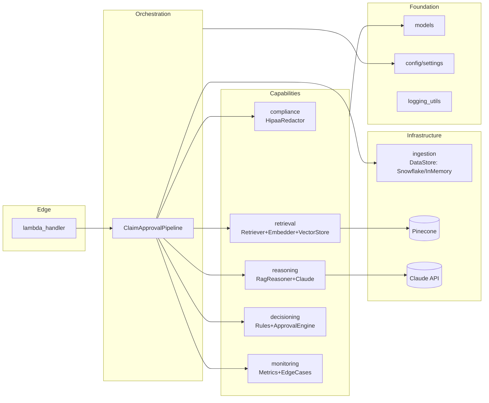
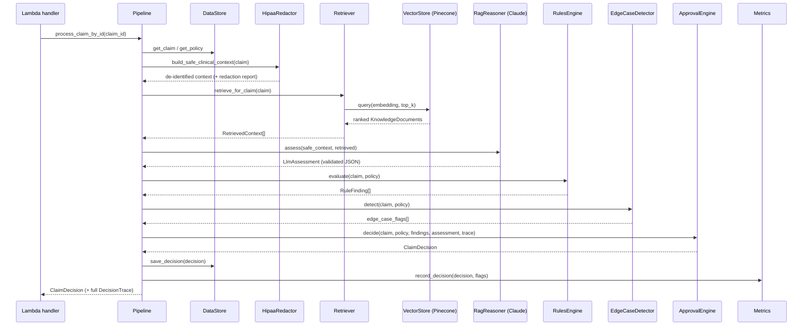
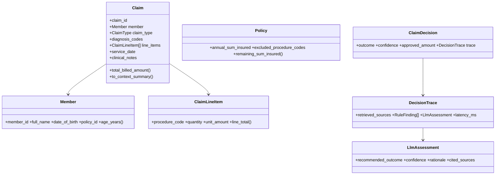

# Automated Insurance Claim Approval Engine — Detailed Design & Architecture

This document is the deep reference for the engine. It explains **what** each component
does, **why** it exists, **how** the code is organised, the **core concepts** behind it, the
**naming conventions**, and the **operational/scaling** model. Read the
[README](../README.md) first for the high-level picture and quickstart.

---

## Table of contents

1. [Goals & non-goals](#1-goals--non-goals)
2. [Core concepts primer](#2-core-concepts-primer)
3. [System architecture](#3-system-architecture)
4. [End-to-end request flow](#4-end-to-end-request-flow)
5. [Layer-by-layer code walkthrough](#5-layer-by-layer-code-walkthrough)
6. [The decision logic (arbitration)](#6-the-decision-logic-arbitration)
7. [HIPAA compliance design](#7-hipaa-compliance-design)
8. [Domain model reference](#8-domain-model-reference)
9. [Configuration & the mock-mode strategy](#9-configuration--the-mock-mode-strategy)
10. [Deployment & scaling](#10-deployment--scaling)
11. [Observability & monitoring](#11-observability--monitoring)
12. [Testing strategy](#12-testing-strategy)
13. [Naming conventions](#13-naming-conventions)
14. [Extension guide](#14-extension-guide)
15. [Mapping to business impact](#15-mapping-to-business-impact)

---

## 1. Goals & non-goals

### Goals

- **Automate the easy majority.** Auto-resolve clearly-approvable and clearly-deniable
  claims so human adjudicators focus on the hard ~30%.
- **Be correct and auditable.** Every decision must be explainable from a persisted trace.
- **Be safe.** Bias the system toward human review whenever uncertain; never let the LLM
  silently deny coverage.
- **Be private.** No PHI leaves the trust boundary un-redacted.
- **Be operable.** Sub-second latency, horizontal scale to 50K+ claims/day, real-time KPIs.
- **Be runnable anywhere.** The full pipeline works offline (mock mode) for development,
  CI and demos, and switches to real cloud services purely via configuration.

### Non-goals

- It is **not** a payments/settlement system — it produces decisions; a downstream system
  disburses funds.
- It does **not** fine-tune a model in this repo; it uses a hosted Claude model with
  prompt engineering + RAG (the standard, lower-risk approach for regulated domains).

---

## 2. Core concepts primer

A short glossary so the rest of the document is self-contained.

### Retrieval-Augmented Generation (RAG)

Instead of relying on a model's parametric memory (which can hallucinate policy terms), RAG
**retrieves** authoritative text (policy clauses, clinical guidelines) relevant to the
current claim and **injects** it into the prompt. The model then reasons over *grounded*
facts and is asked to **cite its sources**. This is what makes the output trustworthy and
auditable.

- **"R" — Retrieval:** `retrieval/` (embeddings + Pinecone).
- **"AG" — Augmented Generation:** `reasoning/` (prompt + Claude).

### Embeddings & vector databases

An **embedding** maps text to a dense numeric vector such that semantically similar text is
nearby in vector space. A **vector database** (Pinecone) indexes millions of such vectors
and answers *approximate-nearest-neighbour* queries in milliseconds. We embed the claim's
clinical/coding summary, then fetch the closest knowledge documents by **cosine similarity**.

### Prompt engineering

The deliberate design of the model's instructions. Here it enforces four things: (1) decide
only from supplied context, (2) emit strict JSON matching a schema, (3) never output
identifiers, (4) produce calibrated confidence. See `reasoning/prompt_templates.py`.

### Hybrid neuro-symbolic decisioning

We combine a **neural** component (the LLM, good at fuzzy/unstructured reasoning) with a
**symbolic** component (deterministic rules, good at exact contractual facts). The symbolic
layer acts as a guardrail that can **veto** the neural recommendation. This is the
industry-standard pattern for trustworthy automation.

### HIPAA Safe-Harbor de-identification

A method of removing 18 categories of identifiers (names, contacts, dates, record numbers,
etc.) so data is no longer "Protected Health Information." We apply it before any external
LLM call. See `compliance/hipaa_redactor.py`.

### AI agent / orchestration

The `ClaimApprovalPipeline` is the **orchestrator** ("agent") that coordinates retrieval,
reasoning and decisioning into a single goal-directed workflow, with LangChain available as
the orchestration framework for the LLM step in production.

---

## 3. System architecture

The engine is organised into **layers** with strict, one-directional dependencies. Higher
layers depend on lower layers through **protocols (interfaces)**, never concrete classes —
this is the Dependency-Inversion Principle and is what enables mock/real swapping.



### Dependency rule

```
pipeline ─▶ {compliance, ingestion, retrieval, reasoning, decisioning, monitoring}
{all capability layers} ─▶ models
{all layers} ─▶ config, logging_utils
models ─▶ (nothing internal)   # leaf layer, no internal imports beyond enums
```

No capability layer imports another capability layer; they communicate only through
**domain models**. This keeps each layer independently testable and replaceable.

---

## 4. End-to-end request flow

Sequence for a single claim through
[`ClaimApprovalPipeline.process_claim`](../src/claim_engine/pipeline/claim_pipeline.py):



Each box that touches an external service (`DataStore`, `VectorStore`, `RagReasoner`) is
selected at composition time as either the **real** or **mock** implementation, but the
sequence above is identical in both cases.

---

## 5. Layer-by-layer code walkthrough

This section maps every module to its responsibility and key methods. File paths are links.

### 5.1 `config/` — settings

[`config/settings.py`](../src/claim_engine/config/settings.py)

- **`Settings`** (Pydantic `BaseSettings`): the single, typed, validated schema for every
  tunable. Loaded from environment / `.env`. Secrets (`ANTHROPIC_API_KEY`, …) use their
  conventional vendor names via aliases; everything else uses the `CLAIM_ENGINE_` prefix.
- **`Settings.resolve_use_mock(credentials_present)`**: the crux of mock-mode logic — an
  integration is mocked if `mock_mode` is on **or** its credentials are absent. This lets
  each integration fall back independently.
- **`get_settings()`**: `lru_cache`-d singleton so the `.env` file is parsed once and all
  components share one configuration view.

### 5.2 `logging_utils.py` — structured logging

[`logging_utils.py`](../src/claim_engine/logging_utils.py)

- **`configure_logging(level)`**: installs a single JSON formatter on the root logger
  (idempotent). Emits one-line JSON suitable for CloudWatch/Datadog ingestion.
- **`get_logger(name)`** / **`log_with_context(logger, level, msg, **context)`**: helpers
  for module loggers and structured key/value log lines.
- Built on the **standard library** deliberately, so the engine needs no logging dependency
  to run in mock mode.

### 5.3 `models/` — domain vocabulary

The typed contracts shared by all layers. Pydantic validates data at every boundary.

| File | Key types | Notable computed logic |
| --- | --- | --- |
| [`enums.py`](../src/claim_engine/models/enums.py) | `ClaimType`, `Gender`, `DecisionOutcome`, `RuleSeverity` | `str`-backed enums for stable serialisation |
| [`claim.py`](../src/claim_engine/models/claim.py) | `Member`, `ClaimLineItem`, `Claim` | `Member.age_years`, `Claim.total_billed_amount`, `Claim.to_context_summary()` (PHI-free) |
| [`policy.py`](../src/claim_engine/models/policy.py) | `Policy` | `remaining_sum_insured`, `is_active_on()`, `covers_claim_type()` |
| [`knowledge.py`](../src/claim_engine/models/knowledge.py) | `KnowledgeDocument`, `RetrievedContext` | `RetrievedContext.as_prompt_block()` (renders source-tagged context) |
| [`decision.py`](../src/claim_engine/models/decision.py) | `RuleFinding`, `LlmAssessment`, `DecisionTrace`, `ClaimDecision` | `ClaimDecision.is_auto_resolved` |

Design note: `Claim.to_context_summary()` and `Member`/identity fields are deliberately
separated so that the retrieval query and the LLM context can be built **without** identity.

### 5.4 `compliance/` — HIPAA redaction

[`compliance/hipaa_redactor.py`](../src/claim_engine/compliance/hipaa_redactor.py)

- **`HipaaRedactor.redact_text(text) -> RedactionReport`**: regex pass that scrubs emails,
  URLs, IPs, SSNs, Aadhaar, phones, MRNs/IDs, dates and honorific names. Conservative by
  design (over-redaction preferred over leakage).
- **`HipaaRedactor.build_safe_clinical_context(claim) -> RedactionReport`**: builds the LLM
  context from **structured, identity-free** fields, then scrubs the free-text notes as a
  second line of defence. Returns the cleaned text **plus** a per-type count of redactions
  for the audit trail.

### 5.5 `ingestion/` — data store

[`ingestion/data_store.py`](../src/claim_engine/ingestion/data_store.py)

- **`ClaimDataStore`** (`Protocol`): `get_claim`, `get_policy`, `save_decision`.
- **`InMemoryClaimDataStore`**: deterministic fixtures (3 canonical claims + a policy) that
  exercise every decision path. Used in mock mode.
- **`SnowflakeClaimDataStore`**: production adapter; lazily imports the driver, uses
  **parameterised** SQL (injection-safe), reuses the connection.
- **`build_data_store(settings)`**: factory choosing the implementation via
  `resolve_use_mock`.

### 5.6 `retrieval/` — the "R" in RAG

- [`embeddings.py`](../src/claim_engine/retrieval/embeddings.py)
  - **`EmbeddingProvider`** (`Protocol`): `dimension`, `embed_text`, `embed_batch`.
  - **`DeterministicEmbedder`**: hash-based bag-of-words embedder, L2-normalised, fully
    deterministic. Shared tokens raise cosine similarity — enough to validate ranking
    offline. Used in mock mode.
  - **`ManagedApiEmbedder`**: sketch adapter for a hosted embedding model.
  - **`build_embedder(settings)`**: factory.
- [`vector_store.py`](../src/claim_engine/retrieval/vector_store.py)
  - **`cosine_similarity(a, b)`**: pure function used by the in-memory store and tests.
  - **`VectorStore`** (`Protocol`): `upsert_documents`, `query`.
  - **`InMemoryVectorStore`**: exact brute-force cosine search; great for tests/small demos.
  - **`PineconeVectorStore`**: production ANN store; lazily creates the serverless index,
    carries document text in metadata so a query returns full documents in one round-trip.
  - **`build_vector_store(settings)`**: factory.
- [`retriever.py`](../src/claim_engine/retrieval/retriever.py)
  - **`PolicyKnowledgeRetriever`**: ties embedder + store together.
    - `index_documents(documents)`: embed + upsert a corpus.
    - `retrieve_for_claim(claim, top_k, filter_by_claim_type)`: build a PHI-free query,
      embed it, query the store, with a **fallback** to an unfiltered search if the
      type-filtered results are too sparse (so the LLM is never starved of grounding).

### 5.7 `reasoning/` — the "AG" in RAG

- [`prompt_templates.py`](../src/claim_engine/reasoning/prompt_templates.py)
  - **`SYSTEM_PROMPT`**: role, guardrails, JSON output contract, confidence calibration,
    PHI hygiene.
  - **`build_user_prompt(safe_claim_context, retrieved)`**: assembles the retrieved
    source-tagged context + de-identified claim facts + task instruction.
- [`claude_client.py`](../src/claim_engine/reasoning/claude_client.py)
  - **`LlmClient`** (`Protocol`): `complete(system_prompt, user_prompt) -> str`.
  - **`ClaudeClient`**: Anthropic Messages API adapter (lazy import, resilient).
  - **`MockClaudeClient`**: deterministic, network-free stand-in. It inspects **only the
    claim section** of the prompt (so guideline wording can't skew it) and emits schema-valid
    JSON via transparent keyword heuristics.
  - **`build_llm_client(settings)`**: factory.
- [`rag_reasoner.py`](../src/claim_engine/reasoning/rag_reasoner.py)
  - **`RagClaimReasoner.assess(safe_claim_context, retrieved) -> LlmAssessment`**: builds the
    prompt, calls the LLM, extracts and validates the JSON. **Critically**, on *any* failure
    (LLM error, no JSON, malformed JSON) it returns a conservative `MANUAL_REVIEW`
    assessment with confidence `0.0` — an unparseable response must never silently approve.

### 5.8 `decisioning/` — rules + arbitration

- [`rules_engine.py`](../src/claim_engine/decisioning/rules_engine.py)
  - **`DeterministicRulesEngine.evaluate(claim, policy) -> list[RuleFinding]`** runs seven
    rules:

    | Rule id | Severity | Checks |
    | --- | --- | --- |
    | `POLICY_ACTIVE` | BLOCKER | service date within coverage window |
    | `CLAIM_TYPE_COVERED` | BLOCKER | claim type in policy's covered set |
    | `NOT_EXCLUDED_PROCEDURE` | BLOCKER | no billed code in exclusion list |
    | `WAITING_PERIOD_SATISFIED` | BLOCKER | service after waiting period |
    | `WITHIN_SUM_INSURED` | WARNING | billed ≤ remaining sum insured |
    | `PRIOR_AUTH_PRESENT` | WARNING | prior-auth present when required |
    | `PROVIDER_IN_NETWORK` | WARNING | provider in network |

- [`approval_engine.py`](../src/claim_engine/decisioning/approval_engine.py)
  - **`ApprovalEngine.decide(...) -> ClaimDecision`**: arbitrates the final ruling (see
    §6). Helpers: `_compute_effective_confidence` (discounts confidence per warning),
    `_compute_approved_amount` (applies co-pay, caps at remaining sum insured),
    `_review_reason` (human-readable escalation reason).

### 5.9 `monitoring/` — metrics + edge cases

- [`edge_case_detector.py`](../src/claim_engine/monitoring/edge_case_detector.py)
  - **`EdgeCaseDetector.detect(claim, policy) -> list[str]`**: flags
    `unspecified_diagnosis`, `cost_outlier`, `sparse_documentation`,
    `out_of_network_high_value`, `near_sum_insured_exhaustion`.
- [`metrics.py`](../src/claim_engine/monitoring/metrics.py)
  - **`MetricsCollector`**: thread-safe accumulator (`record_decision`, `snapshot`).
  - **`MetricsSnapshot`**: throughput, outcome mix, auto-resolution/approval/review rates,
    average & p95 latency, edge-case volume.

### 5.10 `pipeline/` — orchestration + edge

- [`claim_pipeline.py`](../src/claim_engine/pipeline/claim_pipeline.py)
  - **`ClaimApprovalPipeline`**: constructor takes every collaborator (dependency
    injection). `process_claim` is the single authoritative path; `process_claim_by_id`
    loads from the data store first.
  - **`build_pipeline(settings)`**: the **composition root** — instantiates every concrete
    component (mock vs real), wires them, and seeds the default corpus when using the
    in-memory index.
  - **`ClaimNotFoundError`**: raised for missing claim/policy.
- [`lambda_handler.py`](../src/claim_engine/pipeline/lambda_handler.py)
  - **`handler(event, context)`**: AWS entry point; supports direct invoke and SQS batch;
    one failing claim never fails the batch; returns decisions + a metrics snapshot.
  - **`_get_pipeline()`**: caches the pipeline in a module global across warm invocations.

---

## 6. The decision logic (arbitration)

`ApprovalEngine.decide` is where the system's risk policy lives. The order of checks matters.

```mermaid
flowchart TD
    S[Start] --> B{Any BLOCKER rule failed?}
    B -- yes --> DENY[AUTO_DENIED conf=0.99]
    B -- no --> EC[effective_confidence =<br/>llm_confidence − 0.10·#warnings]
    EC --> LD{LLM recommends AUTO_DENIED?}
    LD -- yes --> REV1[MANUAL_REVIEW<br/>LLM cannot hard-deny alone]
    LD -- no --> G{LLM=APPROVE AND<br/>necessity met AND<br/>conf ≥ auto_threshold AND<br/>not high-value AND<br/>no edge flags?}
    G -- yes --> APP[AUTO_APPROVED<br/>payout = billed·(1−copay) capped]
    G -- no --> REV2[MANUAL_REVIEW<br/>with explicit reason]
```

Truth-table highlights:

| Situation | Outcome |
| --- | --- |
| Excluded procedure billed (blocker) | `AUTO_DENIED` |
| Covered, in-network, necessity met, conf 0.93, low value | `AUTO_APPROVED` |
| LLM says deny, but no blocker rule | `MANUAL_REVIEW` (escalate) |
| Confidence 0.55 | `MANUAL_REVIEW` |
| Amount ≥ high-value threshold | `MANUAL_REVIEW` (even if confident) |
| Any edge-case flag present | `MANUAL_REVIEW` |

**Payout formula** (on auto-approval):
`approved = min( billed × (1 − co_payment_rate), remaining_sum_insured )`, never negative.

---

## 7. HIPAA compliance design

Defence-in-depth, applied **before** any data crosses the trust boundary to Claude:

1. **Structural minimisation.** The LLM context (`build_safe_clinical_context`) is built
   from identity-free fields only: claim type, age, gender, diagnosis codes, service
   descriptions, amounts, network flag, and clinical notes. The member's name, email,
   phone, member id and DOB are **never** placed in the prompt.
2. **Pattern scrubbing.** Residual free-text notes pass through `redact_text`, which removes
   emails, phones, SSN/Aadhaar, MRNs/IDs, URLs/IPs, explicit dates and honorific names.
3. **Auditable redaction.** Each pass returns a `RedactionReport` with per-type counts,
   which the pipeline logs (`redactions={...}`) and can attach to the trace.
4. **Determinism in mock mode.** No data ever leaves the process during local/CI runs.

> The redactor is conservative by design: false positives (over-redaction) are acceptable;
> false negatives (leaked PHI) are not.

---

## 8. Domain model reference



---

## 9. Configuration & the mock-mode strategy

- Every external integration has a **factory** (`build_data_store`, `build_embedder`,
  `build_vector_store`, `build_llm_client`) that calls `Settings.resolve_use_mock(...)`.
- An integration is mocked when **global** `mock_mode` is on **or** that integration's
  **credentials are missing** — so partial configurations work (e.g. real Pinecone +
  mocked Snowflake).
- This is what guarantees: *the same code path runs in CI and production*, only the leaf
  implementations differ. It also makes the system trivial to unit-test.

---

## 10. Deployment & scaling

### Topology

```
Claims intake ──▶ Snowflake (system of record)
                      │  (stream / task emits new claim ids)
                      ▼
                  Dispatcher ──▶ Amazon SQS ──▶ AWS Lambda (handler)
                                                   │  ├─ Pinecone (retrieval)
                                                   │  └─ Claude API (reasoning)
                                                   ▼
                                          Decision written back to Snowflake
                                                   │
                                                   ▼
                                     Metrics ──▶ CloudWatch / Prometheus / dashboards
```

### Hitting 50K claims/day in < 1s each

- **Per-claim latency** is dominated by one embedding lookup + one Pinecone query + one
  Claude call. With a low-temperature, capped-token prompt this stays sub-second.
- **Throughput** is achieved by **horizontal** Lambda concurrency, not per-invocation speed:
  50,000 claims/day ≈ **0.58 claims/sec average**; even at a 10× peak (≈6/sec) a handful of
  concurrent Lambda workers suffice. SQS provides buffering and at-least-once delivery.
- **Cold-start mitigation:** the pipeline (and its clients/index handles) is built once per
  warm container and cached in a module global (`_get_pipeline`).
- **Cost control:** only ~30% of claims reach manual review; the deterministic rules short
  -circuit hard denials *before* any LLM call when a blocker fails (the rules are cheap).

### Idempotency & safety

- Decisions are keyed by `claim_id`; re-processing is safe (upsert semantics downstream).
- One poisoned claim in a batch is caught per-item in the handler and does not fail peers.

---

## 11. Observability & monitoring

- **Structured logs:** every adjudication emits a JSON line with `claim_id`, `outcome`,
  `confidence`, `latency_ms`, `edge_cases` and `redactions` counts.
- **Live metrics:** `MetricsCollector.snapshot()` yields auto-resolution/approval/review
  rates, average & p95 latency and edge-case volume — the KPIs that define the business case.
- **Edge-case stream:** flags surface anomalous claims for proactive human attention even
  when the happy path would pass.
- **Production wiring:** mirror counters to Prometheus/CloudWatch; alert on drops in
  auto-approval rate (model/regression drift) or spikes in `llm_unavailable` flags.

---

## 12. Testing strategy

- **Hermetic:** every test forces mock mode — no network, no credentials, deterministic.
- **Unit tests** for each layer: redaction, rules, arbitration, embeddings/retrieval, and
  the reasoner's resilient JSON parsing (including the unparseable-response fallback).
- **End-to-end tests** over the three seeded claims assert approve / deny / review outcomes
  and that metrics update correctly.
- Run with `pytest`; lint with `ruff check`; type-check with `mypy src`.

---

## 13. Naming conventions

Consistent, descriptive names make the code self-documenting (a key requirement of this
project). The conventions used throughout:

| Element | Convention | Examples |
| --- | --- | --- |
| Modules / packages | `snake_case`, singular domain noun | `rules_engine.py`, `compliance/` |
| Classes | `PascalCase`, noun phrase | `ApprovalEngine`, `RagClaimReasoner` |
| Protocols (interfaces) | `PascalCase`, capability noun | `ClaimDataStore`, `EmbeddingProvider` |
| Public methods | `snake_case` verb phrase | `process_claim`, `retrieve_for_claim` |
| Private helpers | leading underscore | `_compute_approved_amount`, `_extract_json` |
| Factories | `build_<thing>` | `build_pipeline`, `build_vector_store` |
| Booleans / predicates | `is_`/`has_`/`requires_` | `is_active_on`, `requires_human_review` |
| Constants | `UPPER_SNAKE_CASE` | `SYSTEM_PROMPT`, `_WARNING_CONFIDENCE_PENALTY` |
| Enums values | `UPPER_SNAKE_CASE` | `AUTO_APPROVED`, `BLOCKER` |
| Settings env vars | `CLAIM_ENGINE_*` (vendor keys keep native names) | `CLAIM_ENGINE_AUTO_APPROVE_THRESHOLD`, `ANTHROPIC_API_KEY` |

Every public class and method carries a docstring describing **intent**, arguments and
return values; comments explain **why**, not **what**.

---

## 14. Extension guide

### Add a new deterministic rule

1. Add a `_check_<name>` method to `DeterministicRulesEngine` returning a `RuleFinding`.
2. Append its call in `evaluate`. Choose `BLOCKER` (vetoes approval) vs `WARNING` (lowers
   confidence) appropriately.
3. Add a unit test in `tests/test_rules_engine.py`.

### Add knowledge to the RAG corpus

1. Add a `KnowledgeDocument` (with a `claim_type` in `metadata`) to
   `knowledge_base.get_default_knowledge_documents()` — or, in production, ingest it into
   Pinecone via `scripts/seed_knowledge_base.py`.

### Swap an LLM / embedding / vector / data provider

Implement the relevant `Protocol` (`LlmClient`, `EmbeddingProvider`, `VectorStore`,
`ClaimDataStore`) and return it from the corresponding `build_*` factory. **No other code
changes** — the pipeline depends only on the protocol.

### Tune the risk posture

Adjust `CLAIM_ENGINE_AUTO_APPROVE_THRESHOLD`, `..._MANUAL_REVIEW_THRESHOLD` and
`..._HIGH_VALUE_THRESHOLD`. Raising the auto-approve threshold trades coverage for safety.

---

## 15. Mapping to business impact

| Claimed outcome | Where it comes from in the design |
| --- | --- |
| **70% auto-approval** | `ApprovalEngine` auto-resolves clean, confident, low-risk claims; everything else escalates |
| **99% accuracy** | Hybrid guardrails: blockers veto bad approvals; LLM grounded by RAG + forced to cite sources; conservative fallbacks |
| **< 1 second / claim** | Single embedding + single ANN query + single capped Claude call; warm-container caching |
| **50K claims/day** | Stateless, horizontally-scaled Lambda behind SQS; cheap rules short-circuit obvious denials |
| **Snowflake + AWS Lambda** | `SnowflakeClaimDataStore` as system of record; `lambda_handler` as serverless surface |
| **HIPAA compliance** | `HipaaRedactor` de-identifies before any external call; prompt forbids identifier output |
| **Real-time monitoring & edge cases** | `MetricsCollector` KPIs + `EdgeCaseDetector` proactive escalation |
| **₹33 Cr saved / year** | ~70% of adjudication labour removed + faster turnaround + fewer leakage errors |

---

*End of design document. For the runnable overview and quickstart, see the
[README](../README.md).*
